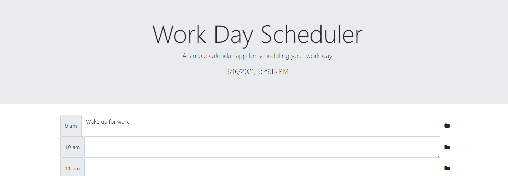

# Day-Planner-2.0

This aplication takes the previous DayPlanner app and upgrades it with React.js ineractivity and states. Prevously repeated HTML code was replaces with auto generating React components to clean up code and make more efficent.

The Day-Planner-App 2.0 contains timeblocks from 9:00am till 5:00pm. The timeblocks background colors are updated relative to the current time. Timeblocks that have passed are colored grey, the current timeblock is colored light-blue, and future timeblocks are colored green. 

The user may click on any timeblock to add events. When the save button is clicked the event for
that timeblock is saved to local storage. When the application is reloaded these events are pulled from storage and displayed appropriatly. 

https://heathw24.github.io/Day-Planner-2.0/

Tools used:
1. React
2. Node.js
3. JavaScript
4. HTMl
5. CSS

